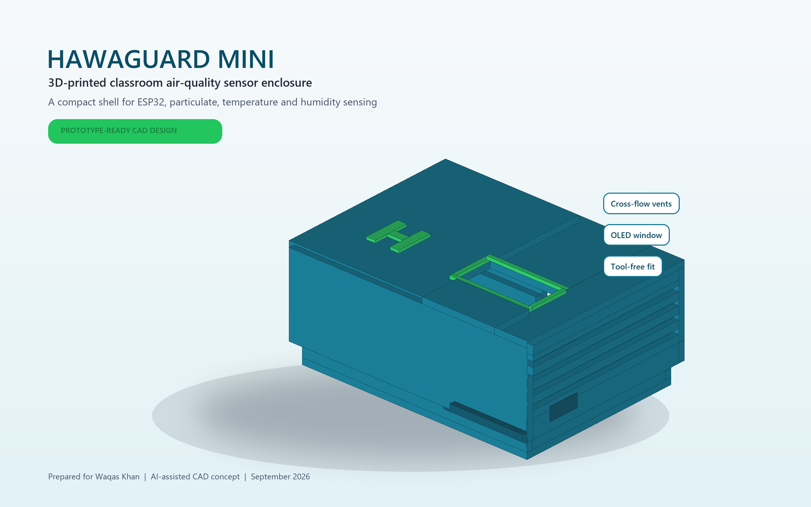
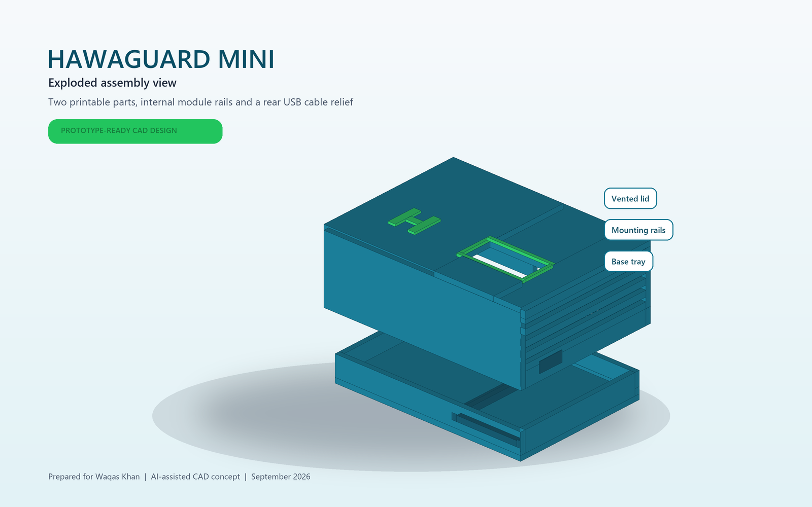

# HawaGuard Mini

An AI-assisted, 3D-printable enclosure concept for a compact classroom air-quality monitoring system.



## Overview

HawaGuard Mini is a two-part enclosure designed around an ESP32-style controller, a compact particulate-matter sensor, a temperature/humidity sensor, and a 0.96-inch OLED display. The enclosure uses cross-flow ventilation, internal mounting rails, a protected display opening, and a rear USB cable relief.

The current repository contains a complete digital design sample. The STL geometry has passed automated manifold-edge checks, but the enclosure has not yet been physically printed or validated with electronics.

## Key features

- Two printable parts: a base tray and vented lid
- Support-free print orientation
- Cross-flow side ventilation for particulate sampling
- Internal bays for an ESP32 DevKit-style board and an SPS30-class sensor
- 29 x 15 mm OLED opening with a raised protective bezel
- Rear 14 mm USB cable relief
- Parametric Python source for regenerating the geometry and renders

## Design specifications

| Item | Specification |
| --- | --- |
| Assembled size | Approximately 95.6 x 69.6 x 42 mm |
| Wall thickness | 2.4 mm nominal |
| Controller bay | Up to 29.2 x 51.5 mm |
| Sensor bay | Up to 42 x 42 mm |
| Lid fit | Friction ribs with 0.35 mm nominal engagement |
| Recommended material | PETG; PLA is suitable for an indoor demonstration |
| Suggested nozzle/layer | 0.4 mm nozzle / 0.20 mm layer height |
| Suggested infill | 15-20% gyroid, 3 perimeters |
| Supports | None expected |



## Repository contents

```text
docs/    Project sample PDF
images/  Product render, exploded view, and dimension sheet
src/     Parametric Python design source
stl/     Ready-to-slice base and lid files
```

## Print and assembly workflow

1. Download both files from the [`stl`](stl/) directory.
2. Place the base floor on the build plate. The lid STL is already oriented with its display face on the build plate.
3. Slice with a 0.4 mm nozzle, 0.20 mm layers, three perimeters, and 15-20% gyroid infill.
4. Inspect the preview for continuous walls and unobstructed vents before printing.
5. Print a short fit test first when possible, then adjust slicer XY compensation if the lid is too tight or loose.
6. Dry-fit the electronics, route USB power through the rear relief, and keep both vent paths clear.
7. Compare sensor readings with a reference monitor before using the device for demonstrations.

## Regenerate the design files

Install Python 3, then run:

```powershell
python -m pip install -r requirements.txt
python src/hawaguard_mini.py
```

Generated files will be written to `src/generated/`.

## Documentation

- [Project sample PDF](docs/HawaGuard_Mini_Project_Sample.pdf)
- [Dimension sheet](images/HawaGuard_Mini_Dimensions.png)

## Project status and attribution

This is an original digital concept prepared for Waqas Khan through an AI-assisted CAD workflow in September 2026. Physical printing, fit testing, electronics integration, sensor calibration, and field validation are the next development steps. Contributions and fabrication feedback are welcome.

No license has been selected yet. All rights are reserved unless a license is added later.
